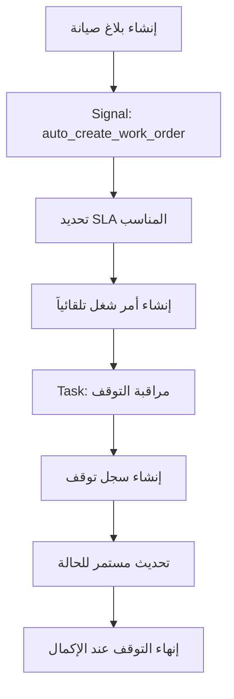
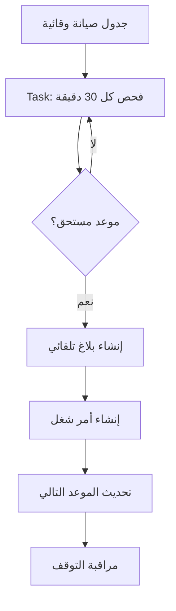

# 🔧 نظام المراقبة التلقائية للصيانة - HMS Background System

## 📋 نظرة عامة

يحتوي نظام HMS على نظام مراقبة تلقائي متطور يعمل في الخلفية لإدارة جميع عمليات الصيانة دون تدخل بشري. النظام يتكون من مكونين رئيسيين:

- **🔔 Signals (`signals.py`)**: للاستجابة الفورية للأحداث
- **⚙️ Background Tasks (`tasks.py`)**: للمراقبة المستمرة والمهام المجدولة

---

## 🔔 نظام الإشارات (Signals System)

### الوظائف الأساسية

#### 1. 📱 إنشاء رموز QR تلقائياً
```python
@receiver(post_save)
def generate_qr_code_on_save()
```
- **الهدف**: إنشاء رموز QR للمرضى والأجهزة والمستخدمين تلقائياً
- **التشغيل**: عند إنشاء أي عنصر جديد
- **الفائدة**: تتبع سريع وسهل للأصول

#### 2. 🔄 التحويل التلقائي للبلاغات
```python
@receiver(post_save, sender=ServiceRequest)
def auto_create_work_order()
```
- **الهدف**: تحويل البلاغات إلى أوامر شغل تلقائياً
- **المعالجة**: 
  - تحديد SLA المناسب حسب نوع الجهاز والأولوية
  - حساب مواعيد الاستجابة والحل
  - إنشاء أمر الشغل مع المواعيد المجدولة
- **النتيجة**: استجابة فورية لجميع البلاغات

#### 3. 📊 تحديث حالات البلاغات
```python
@receiver(post_save, sender=WorkOrder)
def update_service_request_status()
```
- **الهدف**: مزامنة حالات البلاغات مع أوامر الشغل
- **المعالجة**: ربط تلقائي بين حالات العمل
- **الفائدة**: تتبع دقيق لتقدم العمل

#### 4. 🛠️ الصيانة الوقائية التلقائية
```python
@receiver(post_save, sender=PreventiveMaintenanceSchedule)
def setup_pm_schedule_automation()
```
- **الهدف**: إعداد جداول الصيانة الوقائية
- **المعالجة**: تحديد المواعيد التالية للصيانة
- **التكامل**: يعمل مع نظام المراقبة المجدولة

#### 5. 🚨 اكتشاف المشاكل التلقائي
```python
@receiver(post_save, sender=DeviceUsageLog)
def auto_create_maintenance_request()
```
- **الهدف**: إنشاء بلاغات تلقائية عند اكتشاف مشاكل
- **المعالجة**: 
  - تحليل حالة الجهاز من التفقد اليومي
  - تحديد درجة الخطورة
  - إنشاء بلاغ مناسب للمشكلة
- **الفائدة**: استجابة سريعة للمشاكل

#### 6. 📈 إدارة مصفوفة SLA
```python
@receiver(post_save, sender=DeviceCategory)
def auto_generate_sla_matrix_for_category()
```
- **الهدف**: إنشاء مصفوفة SLA تلقائياً للفئات الجديدة
- **المعالجة**: ربط كل فئة جهاز بمعايير SLA المناسبة
- **النتيجة**: ضمان تطبيق معايير الخدمة على جميع الأجهزة

---

## ⚙️ نظام المهام المجدولة (Background Tasks)

### 🏗️ هيكل النظام

```python
class MaintenanceTaskRunner:
    def __init__(self):
        self.running = False
        self.thread = None
```

### 📅 جدولة المهام

| المهمة | التكرار | الوقت | الوصف |
|--------|---------|-------|--------|
| **فحص الصيانة الوقائية** | كل 30 دقيقة | مستمر | إنشاء أوامر الصيانة المستحقة |
| **مراقبة التوقف** | كل دقيقة | مستمر | تتبع أوقات توقف الأجهزة |
| **فحص انتهاكات SLA** | كل ساعتين | مستمر | مراقبة التأخير في الاستجابة |
| **الفحص اليومي** | يومياً | 8:00 ص | فحص الأجهزة وقطع الغيار |
| **التقارير اليومية** | يومياً | 6:00 م | إرسال ملخص اليوم |

### 🔍 المهام التفصيلية

#### 1. 🛠️ مراقبة الصيانة الوقائية
```python
def _check_pm_schedules(self):
```
- **الوظيفة**: فحص الجداول المستحقة وإنشاء أوامر الشغل
- **المعالجة**:
  - البحث عن جداول الصيانة المستحقة
  - التحقق من عدم وجود أعمال مفتوحة
  - إنشاء بلاغ وأمر شغل تلقائياً
  - تحديث موعد الصيانة التالية
- **السجلات**: تسجيل مفصل لجميع العمليات

#### 2. ⏱️ مراقبة أوقات التوقف
```python
def _monitor_downtime_schedules(self):
```
- **الوظيفة**: تتبع تلقائي لأوقات توقف الأجهزة
- **المعالجة**:
  - فحص الأعمال النشطة (أوامر الشغل وطلبات الخدمة)
  - إنشاء/تحديث سجلات التوقف
  - حساب التكاليف المالية
  - إنهاء السجلات عند اكتمال العمل

#### 3. 📊 فحص انتهاكات SLA
```python
def _check_sla_violations(self):
```
- **الوظيفة**: مراقبة الالتزام بمعايير الخدمة
- **المعالجة**:
  - فحص البلاغات وأوامر الشغل المتأخرة
  - إرسال تنبيهات للمسؤولين
  - تسجيل الانتهاكات
- **الفائدة**: ضمان جودة الخدمة

#### 4. 🔍 الفحص اليومي
```python
def _daily_maintenance_check(self):
```
- **الوظيفة**: فحص شامل للنظام
- **المعالجة**:
  - فحص الأجهزة التي تحتاج صيانة
  - مراقبة مخزون قطع الغيار
  - تحديد الأولويات
- **التوقيت**: كل يوم في الساعة 8:00 صباحاً

---

## 🔄 تدفق العمل التلقائي

### 📝 سيناريو: بلاغ صيانة جديد



### 🛠️ سيناريو: صيانة وقائية



---

## 🎯 الفوائد الرئيسية

### ✅ الأتمتة الكاملة
- **لا تدخل بشري**: النظام يعمل بشكل مستقل
- **استجابة فورية**: معالجة البلاغات في ثوانٍ
- **دقة عالية**: تقليل الأخطاء البشرية

### 📊 المراقبة المستمرة
- **24/7**: عمل مستمر دون انقطاع
- **تتبع شامل**: جميع الأجهزة والعمليات
- **تقارير دقيقة**: بيانات موثوقة للقرارات

### 💰 توفير التكاليف
- **تقليل التوقف**: اكتشاف مبكر للمشاكل
- **صيانة وقائية**: منع الأعطال الكبيرة
- **كفاءة الموارد**: استغلال أمثل للفرق

### 🔍 الشفافية والمساءلة
- **سجلات مفصلة**: تتبع كامل للعمليات
- **معايير SLA**: ضمان جودة الخدمة
- **تنبيهات فورية**: إشعار بالمشاكل

---

## 🚀 التشغيل والإدارة

### بدء التشغيل
```python
from maintenance.tasks import start_maintenance_tasks
start_maintenance_tasks()
```

### إيقاف النظام
```python
from maintenance.tasks import stop_maintenance_tasks
stop_maintenance_tasks()
```

### مراقبة السجلات
```bash
# عرض سجلات النظام
tail -f logs/maintenance.log

# فلترة سجلات محددة
grep "DEBUG" logs/maintenance.log
```

---

## 🔧 الإعدادات والتخصيص

### تعديل فترات المراقبة
```python
# في tasks.py - تعديل الجدولة
schedule.every(30).minutes.do(self._check_pm_schedules)  # الصيانة الوقائية
schedule.every(1).minutes.do(self._monitor_downtime_schedules)  # مراقبة التوقف
```

### إعداد معايير SLA
- تحديد أوقات الاستجابة حسب نوع الجهاز
- ضبط مستويات التصعيد
- تخصيص التنبيهات

### تخصيص التقارير
- تحديد محتوى التقارير اليومية
- ضبط قوائم المستلمين
- تعديل أوقات الإرسال

---

## 📈 الإحصائيات والمؤشرات

النظام يوفر مؤشرات أداء شاملة:

- **معدل الاستجابة**: متوسط وقت الاستجابة للبلاغات
- **كفاءة الصيانة**: نسبة الأعمال المكتملة في الوقت المحدد
- **توفر الأجهزة**: نسبة وقت تشغيل الأجهزة
- **التكاليف**: تتبع تكاليف الصيانة والتوقف

---

## 🛡️ الأمان والموثوقية

### آليات الحماية
- **معالجة الأخطاء**: التعامل مع الاستثناءات بأمان
- **النسخ الاحتياطي**: حفظ البيانات الحرجة
- **المراقبة**: تسجيل جميع العمليات

### الاستقرار
- **إعادة التشغيل التلقائي**: في حالة الأخطاء
- **التحقق من الصحة**: فحص سلامة البيانات
- **التنبيهات**: إشعار بالمشاكل الفنية

---

## 📞 الدعم والصيانة

### استكشاف الأخطاء
1. **فحص السجلات**: مراجعة ملفات السجل
2. **حالة النظام**: التحقق من تشغيل المهام
3. **قاعدة البيانات**: فحص سلامة البيانات

### التحديث والتطوير
- **إضافة مهام جديدة**: توسيع وظائف النظام
- **تحسين الأداء**: تطوير الخوارزميات
- **التكامل**: ربط أنظمة خارجية

---

*تم تطوير هذا النظام لضمان أعلى مستويات الكفاءة والموثوقية في إدارة الصيانة الطبية* 🏥✨
