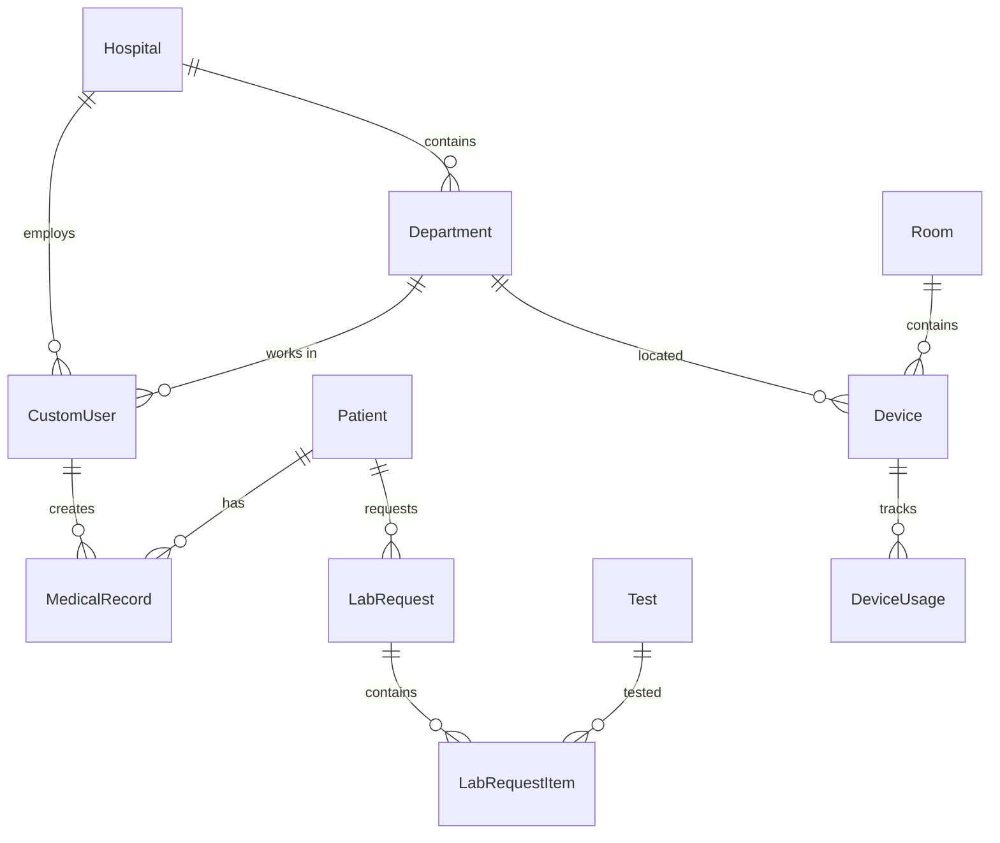

# نظام إدارة المستشفيات (Hospital Management System - HMS)
## دليل شامل للمشروع

---

## 📋 فهرس المحتويات
1. [نظرة عامة على المشروع](#نظرة-عامة-على-المشروع)
2. [الهيكل التقني](#الهيكل-التقني)
3. [قاعدة البيانات](#قاعدة-البيانات)
4. [الوحدات الرئيسية](#الوحدات-الرئيسية)
5. [نظام المصادقة والأذونات](#نظام-المصادقة-والأذونات)
6. [واجهات المستخدم](#واجهات-المستخدم)
7. [تشغيل المشروع](#تشغيل-المشروع)
8. [الميزات المتقدمة](#الميزات-المتقدمة)

---

## 🏥 نظرة عامة على المشروع

### الوصف
نظام إدارة المستشفيات (HMS) هو نظام شامل مطور بـ Django لإدارة جميع عمليات المستشفى من المرضى والموظفين إلى المعدات والمختبرات.

### الأهداف الرئيسية
- **إدارة المرضى**: تسجيل وتتبع بيانات المرضى والسجلات الطبية
- **إدارة الموظفين**: نظام HR شامل للأطباء والممرضين والموظفين
- **إدارة المختبرات**: طلبات التحاليل والنتائج
- **إدارة المعدات**: تتبع وصيانة الأجهزة الطبية
- **التقارير والإحصائيات**: تقارير مفصلة عن أداء المستشفى

---

## 🔧 الهيكل التقني

### التقنيات المستخدمة
```
- Python 3.x
- Django 5.2.5
- SQLite (قاعدة البيانات)
- HTML/CSS/JavaScript (الواجهات)
- Bootstrap (التصميم)
- QR Code Generation (الباركود)
- MPTT (Hierarchical Data)
```

### المتطلبات (requirements.txt)
```
Django==5.2.5
django-mptt==0.17.0          # للهياكل الشجرية (الأقسام)
django-widget-tweaks==1.5.0  # تحسين النماذج
qrcode==8.2                   # إنشاء أكواد QR
pillow==11.3.0               # معالجة الصور
reportlab==4.4.3             # إنشاء PDF
pandas==2.3.1                # معالجة البيانات
requests==2.32.5             # طلبات HTTP
```

### هيكل المجلدات
```
HMS-main/
├── core/                    # إعدادات المشروع الرئيسية
├── superadmin/             # لوحة الإدارة العليا
├── manager/                # إدارة المرضى والسجلات الطبية
├── hr/                     # إدارة الموارد البشرية
├── laboratory/             # إدارة المختبرات
├── maintenance/            # إدارة المعدات والصيانة
├── staff/                  # خدمات الموظفين
├── general/                # الخدمات العامة
├── activity/               # تسجيل الأنشطة
├── accounts/               # إدارة الحسابات
├── templates/              # قوالب HTML
├── static/                 # الملفات الثابتة
├── media/                  # ملفات المستخدمين
└── db.sqlite3             # قاعدة البيانات
```

---

## 🗄️ قاعدة البيانات

### النماذج الرئيسية (Models)

#### 1. نموذج المستشفى (Hospital)
```python
class Hospital(models.Model):
    name = CharField(max_length=100)
    hospital_type = CharField(choices=['general', 'specialized', 'clinic'])
    location = CharField(max_length=200)
    address = TextField()
```

#### 2. نموذج المستخدم المخصص (CustomUser)
```python
class CustomUser(AbstractUser):
    ROLES = ['super_admin', 'doctor', 'nurse', 'receptionist', 'pharmacist', 'hospital_manager', 'hr']
    
    role = CharField(choices=ROLE_CHOICES)
    hospital = ForeignKey(Hospital)
    departments = ManyToManyField(Department)
    national_id = CharField(unique=True)
    job_number = CharField(unique=True)
    salary_base = DecimalField()
    hire_date = DateField()
    attendance_method = CharField(choices=ATTENDANCE_METHODS)
```

#### 3. نموذج المريض (Patient)
```python
class Patient(models.Model):
    first_name = CharField(max_length=50)
    middle_name = CharField(max_length=50, blank=True)
    last_name = CharField(max_length=50)
    birth_year = IntegerField()
    gender = CharField(choices=['male', 'female'])
    national_id = CharField(unique=True)
    phone = CharField()
    address = TextField()
    blood_type = CharField()
    allergies = TextField()
    emergency_contact = CharField()
```

#### 4. نموذج القسم (Department) - هيكل شجري
```python
class Department(MPTTModel):
    name = CharField(max_length=100, unique=True)
    parent = TreeForeignKey('self', null=True, blank=True)
    department_type = CharField(choices=TYPE_CHOICES)
    hospital = ForeignKey(Hospital)
    is_active = BooleanField(default=True)
```

#### 5. نموذج السجل الطبي (MedicalRecord)
```python
class MedicalRecord(models.Model):
    patient = ForeignKey(Patient)
    doctor = ForeignKey(CustomUser)
    department = ForeignKey(Department)
    visit_date = DateTimeField()
    chief_complaint = TextField()
    history_present_illness = TextField()
    physical_examination = TextField()
    diagnosis = TextField()
    treatment_plan = TextField()
    medications = ManyToManyField(Medication)
```

#### 6. نماذج المختبر
```python
class Test(models.Model):
    english_name = CharField(max_length=200)
    arabic_name = CharField(max_length=100)
    category = CharField(choices=['blood', 'urine', 'microbio', 'other'])
    normal_range_min = DecimalField()
    normal_range_max = DecimalField()
    unit = CharField(max_length=50)

class LabRequest(models.Model):
    patient = ForeignKey(Patient)
    doctor = ForeignKey(CustomUser)
    tests = ManyToManyField(Test, through='LabRequestItem')
    status = CharField(choices=STATUS_CHOICES)
    requested_at = DateTimeField()
    qr_code = ImageField()  # للتتبع بالباركود
```

#### 7. نماذج المعدات
```python
class Device(models.Model):
    name = CharField(max_length=200)
    model = CharField(max_length=100)
    serial_number = CharField(unique=True)
    department = ForeignKey(Department)
    room = ForeignKey(Room)
    status = CharField(choices=['working', 'needs_maintenance', 'out_of_order'])
    availability = BooleanField(default=True)
    clean_status = CharField(choices=CLEAN_STATUS_CHOICES)
    sterilization_status = CharField(choices=STERILIZATION_STATUS_CHOICES)
```

### العلاقات بين الجداول



---

## 📦 الوحدات الرئيسية

### 1. وحدة الإدارة العليا (superadmin)
**المسؤوليات:**
- إعداد النظام العام
- إدارة المستشفيات
- إعدادات النظام الأساسية

**الملفات الرئيسية:**
- `models.py`: Hospital, SystemSettings
- `views.py`: لوحة التحكم الرئيسية
- `forms.py`: نماذج الإعدادات

### 2. وحدة إدارة المرضى (manager)
**المسؤوليات:**
- تسجيل المرضى الجدد
- إدارة السجلات الطبية
- إدارة الأسرّة والغرف
- إدارة الأدوية والوصفات

**الملفات الرئيسية:**
- `models.py`: Patient, MedicalRecord, Medication, Room, Bed
- `views.py`: عرض قوائم المرضى، إضافة/تعديل البيانات
- `forms.py`: نماذج إدخال بيانات المرضى
- `icd_cache.py`: تكامل مع نظام ICD-11 للتشخيص

**الميزات الخاصة:**
- نظام QR Code لتتبع المرضى
- تصدير التقارير بصيغة PDF
- نظام تصنيف ICD-11 للأمراض

### 3. وحدة الموارد البشرية (hr)
**المسؤوليات:**
- إدارة بيانات الموظفين
- نظام الحضور والانصراف
- إدارة الرواتب والمكافآت
- إدارة الإجازات والمهام

**النماذج الرئيسية:**
```python
# الموظف
CustomUser: البيانات الأساسية والوظيفية

# الشهادات والتراخيص
Certificate: شهادات الموظفين
ProfessionalPracticePermit: تراخيص المزاولة
HealthInsurance: التأمين الصحي

# الجداول والمناوبات
Schedule: جداول العمل
StaffDailyAvailability: توفر الموظفين اليومي
ShiftType: أنواع المناوبات

# الحضور والرواتب
Attendance: سجل الحضور
Payroll: كشوف الرواتب
Bonus: المكافآت والحوافز

# الإجازات
VacationPolicy: سياسات الإجازات
LeaveRequest: طلبات الإجازة
VacationBalance: أرصدة الإجازات
```

### 4. وحدة المختبرات (laboratory)
**المسؤوليات:**
- إدارة طلبات التحاليل
- تسجيل النتائج
- تتبع العينات
- إنشاء التقارير

**سير العمل:**
1. **طلب التحليل**: الطبيب يطلب تحاليل للمريض
2. **قبول الطلب**: المختبر يقبل الطلب
3. **جمع العينة**: أخذ العينة من المريض
4. **إجراء التحليل**: تنفيذ الفحوصات
5. **تسجيل النتائج**: إدخال النتائج
6. **المراجعة والاعتماد**: مراجعة النتائج من قبل المختص

### 5. وحدة الصيانة (maintenance)
**المسؤوليات:**
- تتبع المعدات الطبية
- جدولة الصيانة
- تسجيل الأعطال
- إدارة النظافة والتعقيم

**حالات المعدات:**
- `working`: يعمل بشكل طبيعي
- `needs_maintenance`: يحتاج صيانة
- `out_of_order`: عطل دائم
- `needs_check`: يحتاج فحص

### 6. وحدة الأنشطة (activity)
**المسؤوليات:**
- تسجيل جميع أنشطة النظام
- تتبع التكاليف
- إنشاء تقارير الاستخدام

**نظام التسعير:**
```python
# تسعير العمليات
OperationPrice: 
  - patient.create: 10.00 ريال
  - lab.test.*: 5.00 ريال
  - *: 1.00 ريال (افتراضي)

# سجل الأنشطة
ActivityLog:
  - المستخدم
  - نوع العملية
  - الوقت
  - التكلفة
```

---

## 🔐 نظام المصادقة والأذونات

### الأدوار (Roles)
1. **Super Admin**: إدارة النظام الكاملة
2. **Hospital Manager**: إدارة المستشفى
3. **Doctor**: الأطباء - إدارة المرضى والتشخيص
4. **Nurse**: الممرضين - رعاية المرضى
5. **Receptionist**: موظف الاستقبال - تسجيل المرضى
6. **Pharmacist**: الصيدلي - إدارة الأدوية
7. **HR**: الموارد البشرية - إدارة الموظفين

### نظام الأذونات
```python
# في settings.py
AUTH_USER_MODEL = "hr.CustomUser"
LOGIN_URL = reverse_lazy("superadmin:login")

# الحماية في Views
@login_required
@user_passes_test(lambda u: u.role == 'doctor')
def doctor_view(request):
    # كود خاص بالأطباء فقط
```

### طرق الحضور والانصراف
1. **Fingerprint**: بصمة الإصبع
2. **Facial Print**: التعرف على الوجه
3. **Login/Logout**: تسجيل الدخول/الخروج
4. **KPI-Based**: حسب مؤشرات الأداء

---

## 🎨 واجهات المستخدم

### التقنيات المستخدمة
- **Bootstrap 5**: للتصميم المتجاوب
- **jQuery**: للتفاعل
- **Chart.js**: للرسوم البيانية
- **DataTables**: لجداول البيانات

### القوالب الرئيسية
```
templates/
├── base.html                 # القالب الأساسي
├── patients/
│   ├── patient_list.html     # قائمة المرضى
│   ├── patient_detail.html   # تفاصيل المريض
│   └── patient_form.html     # نموذج إضافة/تعديل
├── departments/
│   ├── department_list.html  # قائمة الأقسام
│   └── department_node.html  # عرض هيكل الأقسام
└── laboratory/
    ├── lab_request_list.html # طلبات المختبر
    └── test_results.html     # نتائج التحاليل
```

### الميزات التفاعلية
- **البحث المتقدم**: في جميع القوائم
- **الفلترة**: حسب التاريخ، القسم، الحالة
- **التصدير**: PDF, Excel
- **الطباعة**: تقارير مخصصة
- **QR Code**: لتتبع المرضى والطلبات

---

## 🚀 تشغيل المشروع

### متطلبات التشغيل
```bash
# تثبيت Python 3.8+
# تثبيت pip

# إنشاء بيئة افتراضية
python -m venv venv
venv\Scripts\activate  # Windows
source venv/bin/activate  # Linux/Mac

# تثبيت المتطلبات
pip install -r requirements.txt
```

### إعداد قاعدة البيانات
```bash
# إنشاء الجداول
python manage.py makemigrations
python manage.py migrate

# إنشاء مستخدم إداري
python manage.py createsuperuser

# تحميل البيانات الأولية (اختياري)
python manage.py loaddata initial_data.json
```

### تشغيل الخادم
```bash
# تشغيل خادم التطوير
python manage.py runserver

# الوصول للنظام
http://localhost:8000
```

### إعدادات مهمة في settings.py
```python
# قاعدة البيانات
DATABASES = {
    'default': {
        'ENGINE': 'django.db.backends.sqlite3',
        'NAME': BASE_DIR / 'db.sqlite3',
    }
}

# اللغات المدعومة
LANGUAGES = (
    ('ar', 'Arabic'),
    ('en', 'English'),
)

# إعدادات ICD-11
ICD11_CLIENT_ID = "your-client-id"
ICD11_CLIENT_SECRET = "your-client-secret"
ICD11_XLSX_PATH = BASE_DIR / "core" / "static" / "icd" / "icd11.xlsx"
```

---

## ⚡ الميزات المتقدمة

### 1. تكامل ICD-11
- تصنيف الأمراض حسب المعايير الدولية
- بحث تلقائي في قاعدة بيانات ICD-11
- ترجمة التشخيصات

### 2. نظام QR Code
```python
# إنشاء QR Code للمريض
def generate_patient_qr(patient):
    qr = qrcode.make(f"patient:{patient.id}")
    # حفظ الصورة
```

### 3. التقارير المتقدمة
- تقارير PDF مخصصة
- إحصائيات شاملة
- رسوم بيانية تفاعلية

### 4. نظام الإشعارات
- إشعارات الصيانة
- تذكيرات الأدوية
- تنبيهات المواعيد

### 5. API للتكامل الخارجي
```python
# مثال API endpoint
@api_view(['GET'])
def patient_api(request, patient_id):
    patient = Patient.objects.get(id=patient_id)
    return Response(PatientSerializer(patient).data)
```

---

## 📊 إحصائيات المشروع

### حجم الكود
- **إجمالي الملفات**: 200+ ملف
- **أسطر الكود**: 15,000+ سطر
- **النماذج**: 50+ نموذج
- **العروض**: 100+ عرض
- **القوالب**: 80+ قالب

### الوحدات
- **8 وحدات رئيسية**
- **قاعدة بيانات واحدة (SQLite)**
- **دعم متعدد اللغات (عربي/إنجليزي)**

---

## 🔧 الصيانة والتطوير

### النسخ الاحتياطية
```bash
# نسخ احتياطي لقاعدة البيانات
python manage.py dumpdata > backup.json

# استعادة النسخة الاحتياطية
python manage.py loaddata backup.json
```

### إضافة ميزات جديدة
1. إنشاء التطبيق الجديد
2. تعريف النماذج
3. إنشاء الهجرات
4. كتابة العروض
5. تصميم القوالب
6. إضافة URLs

### الاختبارات
```bash
# تشغيل الاختبارات
python manage.py test

# اختبار تطبيق محدد
python manage.py test manager
```

---

## 📞 الدعم والمساعدة

### المشاكل الشائعة
1. **خطأ في قاعدة البيانات**: تشغيل migrate
2. **مشاكل الصلاحيات**: التحقق من الأدوار
3. **ملفات مفقودة**: التحقق من MEDIA_ROOT

### التحديثات المستقبلية
- [ ] تطبيق جوال
- [ ] تكامل مع أنظمة خارجية
- [ ] ذكاء اصطناعي للتشخيص
- [ ] نظام المواعيد المتقدم

---

## 📝 ملاحظات مهمة

1. **الأمان**: تغيير SECRET_KEY في الإنتاج
2. **الأداء**: استخدام قاعدة بيانات أقوى للإنتاج
3. **النسخ الاحتياطية**: جدولة نسخ احتياطية منتظمة
4. **المراقبة**: تفعيل نظام مراقبة الأداء

---

## 🔗 تفاصيل الـ Views والـ URLs والـ Signals

### 📄 Views (العروض)

#### 1. Manager Views (إدارة المرضى)
**الملف**: `manager/views.py` (2919 سطر)

**الفئات الرئيسية**:
- **PatientListView**: عرض قائمة المرضى مع البحث والفلترة
- **PatientDetailView**: تفاصيل المريض مع السجلات الطبية
- **PatientCreateView**: إضافة مريض جديد
- **MedicalRecordCreateView**: إنشاء سجل طبي جديد
- **PrescriptionCreateView**: إنشاء وصفة طبية
- **AdmissionCreateView**: إدخال المريض للمستشفى
- **DoctorListView**: قائمة الأطباء
- **BedListView**: إدارة الأسرّة
- **DepartmentViews**: إدارة الأقسام

**الميزات الخاصة**:
```python
# تصدير PDF للمريض
def download_patient_pdf(request, patient_id):
    # إنشاء تقرير PDF شامل للمريض
    
# إنشاء QR Code للمريض
def download_qr_code(request, patient_id):
    # إنشاء كود QR للتتبع
    
# طباعة سوار المريض
def download_wristband(request, patient_id):
    # إنشاء سوار معصم للمريض مع QR Code
```

**نظام التقارير المتقدم**:
- تقارير PDF مخصصة للمرضى
- إعدادات التقارير القابلة للتخصيص
- تكامل مع نظام ICD-11 للتشخيص

#### 2. HR Views (الموارد البشرية)
**الملف**: `hr/views.py` (1040 سطر)

**الفئات الرئيسية**:
- **StaffListView**: قائمة الموظفين مع الإحصائيات
- **StaffCreateView**: إضافة موظف جديد
- **AttendanceListView**: سجل الحضور والانصراف
- **PayrollListView**: كشوف الرواتب
- **ScheduleListView**: جداول العمل والمناوبات
- **LeaveRequestListView**: طلبات الإجازات
- **BonusCreateView**: إضافة مكافآت
- **DeductionCreateView**: إضافة خصومات

**نظام الحضور المتقدم**:
```python
# مزامنة الحضور من أجهزة ZKTeco
def sync_attendance_from_zkteco(request):
    # مزامنة البيانات من أجهزة البصمة
    
# حساب الرواتب التلقائي
class PayrollCreateView(CreateView):
    # حساب الراتب مع المكافآت والخصومات
```

#### 3. Laboratory Views (المختبرات)
**الملف**: `laboratory/views.py` (1014 سطر)

**الفئات الرئيسية**:
- **LabRequestCreateView**: إنشاء طلب تحليل جديد
- **LabRequestListView**: قائمة طلبات التحاليل
- **TestResultListView**: نتائج التحاليل
- **TestGroupListView**: مجموعات التحاليل
- **PatientLabResultsView**: نتائج المريض

**سير العمل المتقدم**:
```python
# إضافة نتائج للطلب
def add_results_for_request(request, request_id):
    # إنشاء نتائج مبدئية للاختبارات
    
# طباعة نتائج المريض
def patient_lab_results_print(request, patient_id):
    # تقرير PDF لنتائج المختبر
```

#### 4. Maintenance Views (الصيانة)
**الملف**: `maintenance/views.py` (476 سطر)

**الوظائف الرئيسية**:
- **device_list**: قائمة المعدات مع الفلترة
- **clean_device**: تسجيل تنظيف الجهاز
- **sterilize_device**: تسجيل تعقيم الجهاز
- **perform_maintenance**: تسجيل الصيانة
- **transfer_device**: نقل الجهاز بين الأقسام
- **assign_device**: تخصيص الجهاز للمريض

**نظام التتبع المتقدم**:
```python
# تاريخ التنظيف
def cleaning_history(request, device_id):
    logs = device.cleaning_logs.all()
    
# تاريخ الصيانة
def maintenance_history(request, device_id):
    logs = device.maintenance_logs.all()
```

### 🛣️ URLs (المسارات)

#### 1. Manager URLs
**الملف**: `manager/urls.py` (276 سطر)

**المسارات الرئيسية**:
```python
urlpatterns = [
    # المرضى
    path("", PatientListView.as_view(), name="patient_list"),
    path("create/", PatientCreateView.as_view(), name="patient_create"),
    path("<int:pk>/", PatientDetailView.as_view(), name="patient_detail"),
    
    # التقارير والطباعة
    path("<int:patient_id>/pdf/", download_patient_pdf, name="patient_pdf"),
    path("<int:patient_id>/wristband/", download_wristband, name="download_wristband"),
    path("<int:patient_id>/qrcode/", download_qr_code, name="download_qr_code"),
    
    # الإدخال والنقل
    path("admissions/", AdmissionListView.as_view(), name="admission_list"),
    path("admissions/new/", AdmissionCreateView.as_view(), name="admission_create"),
    
    # الوصفات الطبية
    path("prescriptions/list/", PrescriptionListView.as_view(), name="prescription_list"),
    path("prescriptions/<int:pk>/", PrescriptionDetailView.as_view(), name="prescription_detail"),
    
    # الأقسام والهيكل
    path("departments/", department_list, name="department_list"),
    path("departments/add/", add_department, name="department_add"),
    path("departments/<int:department_id>/devices/", department_devices, name="department_devices"),
    
    # AJAX للتحديث الديناميكي
    path("ajax/load-floors/", ajax_load_floors, name="ajax_load_floors"),
    path("ajax/load-wards/", ajax_load_wards, name="ajax_load_wards"),
    path("ajax/load-rooms/", ajax_load_rooms, name="ajax_load_rooms"),
    
    # ICD-11 للتشخيص
    path("ajax/icd11-autocomplete/", icd11_autocomplete, name="icd11_autocomplete"),
]
```

#### 2. HR URLs
**الملف**: `hr/urls.py` (78 سطر)

```python
urlpatterns = [
    # تسجيل الدخول
    path('login/', CommonLoginView.as_view(), name='login'),
    
    # الموظفين
    path('staff/', StaffListView.as_view(), name='staff_list'),
    path('staff/new/', StaffCreateView.as_view(), name='staff_create'),
    path('staff/<int:pk>/', StaffDetailView.as_view(), name='staff_detail'),
    
    # الحضور والانصراف
    path('attendance/', AttendanceListView.as_view(), name='attendance_list'),
    path('attendance/sync/', sync_attendance_from_zkteco, name='sync_attendance'),
    
    # الرواتب
    path('payroll/', PayrollListView.as_view(), name='payroll_list'),
    path('payroll/bonus/create/', GlobalBonusCreateView.as_view(), name='global_bonus_create'),
    path('payroll/deduction/create/', GlobalDeductionCreateView.as_view(), name='global_deduction_create'),
    
    # الإجازات
    path('leave-requests/', LeaveRequestListView.as_view(), name='leave_request_list'),
    path('leave-requests/new/', LeaveRequestCreateView.as_view(), name='leave_request_create'),
    
    # المناوبات
    path('schedules/', ScheduleListView.as_view(), name='schedule_list'),
    path('shifts/', ShiftAssignmentListView.as_view(), name='shift_assignment_list'),
]
```

#### 3. Laboratory URLs
**الملف**: `laboratory/urls.py` (134 سطر)

```python
urlpatterns = [
    # طلبات المختبر
    path("lab-request/new/<int:patient_id>/", LabRequestCreateView.as_view(), name="lab_request_add"),
    path("requests/", LabRequestListView.as_view(), name="lab_request_list"),
    path("requests/<int:pk>/", LabRequestDetailView.as_view(), name="lab_request_detail"),
    
    # التحاليل
    path("tests/", TestListView.as_view(), name="test_list"),
    path("tests/new/", TestCreateView.as_view(), name="test_create"),
    
    # مجموعات التحاليل
    path("test-groups/", TestGroupListView.as_view(), name="testgroup_list"),
    path("test-groups/new/", TestGroupCreateView.as_view(), name="testgroup_create"),
    
    # نتائج المريض
    path("patients/<int:patient_id>/results/", PatientLabResultsView.as_view(), name="patient_lab_results"),
    path("patients/<int:patient_id>/results/print/", patient_lab_results_print, name="patient_lab_results_print"),
    
    # مسح QR Code
    path("requests/scan/<uuid:token>/", lab_request_scan, name="lab_request_scan"),
    path("samples/scan/<uuid:token>/", sample_scan, name="sample_scan"),
]
```

### 📡 Signals (الإشارات)

#### 1. Manager Signals
**الملف**: `manager/signals.py` (61 سطر)

```python
# إنشاء قسم العمليات تلقائياً عند إنشاء مستشفى جديد
@receiver(post_save, sender=Hospital)
def create_main_surgical_department(sender, instance, created, **kwargs):
    if created:
        main_dept = Department.objects.create(
            name='قسم العمليات الجراحية',
            hospital=instance,
            parent=None
        )
        SurgicalOperationsDepartment.objects.create(
            name='غرف العمليات',
            surgical_type='عام',
            location='الدور الأرضي',
            hospital=instance,
            department=main_dept
        )

# إنشاء زيارة OPD تلقائياً لكل مريض جديد
@receiver(post_save, sender=Patient)
def create_opd_visit(sender, instance, created, **kwargs):
    if not created:
        return
    
    # إنشاء قسم OPD إذا لم يكن موجوداً
    opd_dept, _ = Department.objects.get_or_create(
        hospital=instance.hospital,
        name="OPD",
        defaults={
            "department_type": "department",
            "is_active": True,
        },
    )
    
    # إنشاء زيارة خارجية
    Visit.objects.create(
        patient=instance,
        hospital=instance.hospital,
        department=opd_dept,
        visit_type="outpatient",
        visit_date=timezone.now(),
        status="active",
    )
```

#### 2. Activity Signals
**الملف**: `activity/signals.py` (11 سطر)

```python
# تسجيل تسجيل الدخول
@receiver(user_logged_in)
def on_login(sender, request, user, **kwargs):
    emit_activity("auth.login", user=user, action="login", 
                 extra={"username": user.get_username()})

# تسجيل تسجيل الخروج
@receiver(user_logged_out)
def on_logout(sender, request, user, **kwargs):
    emit_activity("auth.logout", user=user, action="logout", 
                 extra={"username": getattr(user, "username", None)})
```

### 🔧 Mixins (الخلطات)

#### 1. Manager Mixins
**الملف**: `manager/mixins.py` (14 سطر)

```python
class HospitalmanagerRequiredMixin(LoginRequiredMixin, UserPassesTestMixin):
    """
    يسمح بالوصول فقط للمستخدمين المصادق عليهم والمرتبطين بمستشفى.
    """
    def test_func(self):
        user = self.request.user
        return user.is_authenticated and hasattr(user, "hospital")
```

#### 2. Activity Mixins
**الملف**: `activity/mixins.py`

```python
class ActivityTrackingMixin:
    """
    تتبع الأنشطة تلقائياً للعمليات CRUD
    """
    def form_valid(self, form):
        response = super().form_valid(form)
        emit_activity(
            operation_key=f"{self.model._meta.label_lower}.create",
            user=self.request.user,
            content_object=self.object
        )
        return response
```

## 🎯 الميزات المتقدمة في Views

### 1. نظام البحث والفلترة
```python
# في PatientListView
def get_queryset(self):
    queryset = Patient.objects.filter(hospital=self.request.user.hospital)
    search = self.request.GET.get('search')
    if search:
        queryset = queryset.filter(
            Q(first_name__icontains=search) |
            Q(last_name__icontains=search) |
            Q(national_id__icontains=search)
        )
    return queryset
```

### 2. AJAX للتحديث الديناميكي
```python
# تحميل الغرف حسب القسم
def ajax_load_rooms(request):
    department_id = request.GET.get('department')
    rooms = Room.objects.filter(ward__floor__building__department_id=department_id)
    return JsonResponse({
        'rooms': [{'id': r.id, 'name': r.name} for r in rooms]
    })
```

### 3. تصدير PDF المتقدم
```python
# إنشاء تقرير PDF للمريض
def download_patient_pdf(request, patient_id):
    patient = get_object_or_404(Patient, pk=patient_id)
    
    # إنشاء PDF باستخدام ReportLab
    buffer = BytesIO()
    doc = SimpleDocTemplate(buffer, pagesize=letter)
    
    # إضافة المحتوى
    story = []
    story.append(Paragraph(f"تقرير المريض: {patient.full_name}", title_style))
    
    # بناء PDF وإرجاعه
    doc.build(story)
    buffer.seek(0)
    
    response = HttpResponse(buffer, content_type='application/pdf')
    response['Content-Disposition'] = f'attachment; filename="patient_{patient.id}.pdf"'
    return response
```

### 4. نظام QR Code المتقدم
```python
# إنشاء QR Code للمريض
def download_qr_code(request, patient_id):
    patient = get_object_or_404(Patient, pk=patient_id)
    
    # إنشاء QR Code
    qr = qrcode.QRCode(version=1, box_size=10, border=5)
    qr.add_data(f"patient:{patient.id}:{patient.mrn}")
    qr.make(fit=True)
    
    # تحويل إلى صورة
    img = qr.make_image(fill_color="black", back_color="white")
    
    # إرجاع كـ HTTP Response
    response = HttpResponse(content_type="image/png")
    img.save(response, "PNG")
    return response
```

## 📊 إحصائيات الكود المفصلة

### Views
- **manager/views.py**: 2919 سطر، 267 دالة/فئة
- **hr/views.py**: 1040 سطر، 148 دالة/فئة  
- **laboratory/views.py**: 1014 سطر، 85 دالة/فئة
- **maintenance/views.py**: 476 سطر، 49 دالة
- **إجمالي Views**: 5449+ سطر

### URLs
- **manager/urls.py**: 276 سطر، 80+ مسار
- **hr/urls.py**: 78 سطر، 25+ مسار
- **laboratory/urls.py**: 134 سطر، 30+ مسار
- **إجمالي URLs**: 488+ سطر، 135+ مسار

### Signals & Mixins
- **manager/signals.py**: 61 سطر، 2 إشارة
- **activity/signals.py**: 11 سطر، 2 إشارة
- **manager/mixins.py**: 14 سطر، 1 mixin
- **إجمالي**: 86+ سطر

---

*تم إنشاء هذا الدليل في: 2025-08-22*
*إصدار النظام: 1.0*
*المطور: فريق تطوير HMS*
